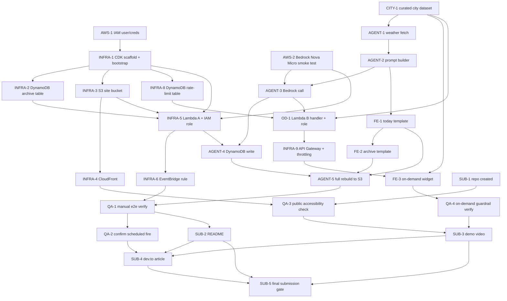

# Daybreak Verse — Task Backlog

User stories derived from [`DESIGN.md`](./DESIGN.md), grouped into epics, with dependencies and recommended build order. Solo-developer backlog — "parallel" below means order-independent, not literally simultaneous.

**Revision note**: rewritten to match DESIGN.md's second grilling pass, which split the app into an **autonomous path** (Lambda A, the required evidence) and an **on-demand path** (Lambda B, a clearly-labeled bonus feature). Changes from the first backlog: added `CITY` and `OD` epics; removed the SSM story and the AWS Budget alert story (both explicitly dropped in DESIGN.md); replaced the old JSON-render + client-fetch frontend model with server-rendered full-HTML-rebuild (FE stories now produce templates consumed by `AGENT-5`, not standalone fetch-driven pages); reworded `AWS-2` (no Bedrock approval wait needed, just a smoke test). **Second revision**: added an Owner line to every story and the "What I need from you" section below, based on an actual check of this dev environment.

## Environment findings (why the ownership split looks the way it does)

- `node` / `npm` / `npx cdk` — available now, nothing needed.
- `aws` CLI — not installed, but I can install it myself without `sudo` (user-directory install) once needed.
- `gh` CLI — not installed.
- SSH key `~/.ssh/id_ed25519` — **already authorized on GitHub as `mgbaybay`** (verified via `ssh -T git@github.com`), and `git` identity is already set. So once a repo *exists*, I can `git push` to it myself — no further GitHub setup needed for that part.
- **No AWS credentials anywhere in this environment.** This is the one hard blocker: I cannot create an IAM user, generate an access key, or touch any AWS API until credentials exist here. Nothing else in the backlog can start without this.

## What I need from you, in order

1. **Create the IAM user + access key, then configure it here.** I can't do this part myself — a brand-new account has no credentials for me to act under, so the very first identity has to come from you via the AWS Console. I'll hand you the exact least-privilege IAM policy JSON (scoped to only Lambda, EventBridge, DynamoDB, S3, CloudFront, API Gateway, Bedrock `InvokeModel` on the Nova Micro ARN — nothing else) when we start `AWS-1`. Once you've created the user and have an access key, run `aws configure` — either in your own terminal, or right here by typing `!aws configure` (the `!` prefix runs it in this session so I can see it's done, without you ever pasting the secret key into chat). After that, I can run `aws sts get-caller-identity`, `cdk deploy`, `aws lambda invoke`, `aws logs tail`, etc. myself for everything downstream.
2. **Create the empty public GitHub repo** (`daybreak-verse`, public, no README/license — I'll add those). Takes about 30 seconds on github.com. Once it exists, tell me the exact remote (I'll assume `git@github.com:mgbaybay/daybreak-verse.git` based on your git config — correct me if your GitHub username differs). After that I can `git init`, commit, and push myself via the SSH key that's already authorized.
3. **Confirm you have a dev.to account** ready to publish under (I only need a yes/no — I can't create or publish the article myself, since that needs your login session).
4. **Record the demo video and send me the link.** I have no screen-recording or camera capability, so this step is yours regardless of tooling. I'll write you a shot-list once the site is live; you record, upload unlisted to YouTube, and send me the URL so I can embed it in the README and article.
5. **Paste the drafted dev.to article into dev.to and publish it, then send me the live URL.** I'll write the full draft (title, tag, all 5 required sections, ≥500 words) once the build is far enough along to describe honestly — publishing itself needs to happen from your account.
6. **A go-ahead before the first real `cdk deploy`.** Not strictly "needed to do the work," but deploying creates real billable AWS resources — I'll ask once, right before that command, rather than assuming.

Everything else in the backlog — all code, all CDK infrastructure, all deployment and verification commands, the README, and the article draft — I can do myself once #1 and #2 above are in place.

## Epics

- **AWS** — account/access foundation
- **CITY** — shared city/coordinate data
- **INFRA** — CDK-defined AWS resources
- **AGENT** — shared generation logic + the autonomous Lambda A pipeline
- **OD** — on-demand path (Lambda B, API Gateway)
- **FE** — HTML templates and the on-demand widget
- **QA** — verification that autonomy (and the guardrails) actually work
- **SUB** — submission deliverables (repo, README, video, article)
- **NICE** — cut-if-short-on-time extras

## Dependency graph

## Stories

### Phase 0 — Foundations (start immediately, no blockers)

**AWS-1 — IAM credentials configured**
> As the developer, I want a scoped IAM user with only the permissions this project needs, so that I can deploy without using long-lived root credentials.
- AC: `aws sts get-caller-identity` succeeds locally under a project-scoped profile, not root.
- Depends on: nothing.
- **Owner: You.** I'll provide the IAM policy JSON and the exact `aws configure` command; you're the one who has to create the user/key in the AWS Console and run it, since no credentials exist here yet for me to act under.

**AWS-2 — Bedrock Nova Micro smoke test**
> As the developer, I want to confirm Nova Micro actually responds to an `InvokeModel` call in `us-east-1`, so that I trust the model is usable before wiring the real pipeline to it.
- AC: a one-off CLI/console `InvokeModel` call returns generated text. (No manual "request access" approval step is expected — AWS auto-enables serverless access to Amazon-owned models — but verify, don't assume.)
- Depends on: AWS-1.
- **Owner: Me**, once AWS-1's credentials are configured. If it turns out access genuinely isn't auto-enabled, the fallback (a console checkbox to enable the model) would need you, but I'll try first.

**INFRA-1 — CDK project scaffolded and bootstrapped**
> As the developer, I want a CDK app bootstrapped in `us-east-1`, so that all later infrastructure stories have somewhere to live.
- AC: `cdk bootstrap` succeeds; empty stack deploys cleanly.
- Depends on: AWS-1.
- **Owner: Me**, once AWS-1 is done. `npx cdk` already works here.

**SUB-1 — Public GitHub repo created**
> As the developer, I want the `daybreak-verse` repo public on GitHub from day one, so that commit history itself becomes part of the evidence trail and there's no last-minute visibility scramble.
- AC: repo exists, public, empty scaffold pushed.
- **Owner: You** for creating the empty repo (needs your GitHub login; I have no `gh` CLI/token here). **Owner: Me** for everything after — `git init`, commits, and `git push` work already since your SSH key is authorized.
- Depends on: nothing.

**CITY-1 — Curated city dataset**
> As the developer, I want a hardcoded list of ~40–50 major cities with lat/lon (including the default, Binangonan, Rizal, Philippines), so that both the on-demand dropdown and the weather fetch have one shared source of truth with no runtime geocoding.
- AC: single data file exported as `{id, label, lat, lon}[]`; default city is in the list and flagged as such.
- Depends on: nothing.
- **Owner: Me.** Pure data authoring, no external access needed.

### Phase 1 — Shared agent logic (testable standalone, before any Lambda is deployed)

**AGENT-1 — Weather fetch**
> As the agent, I want today's weather for a given lat/lon from Open-Meteo, so that the poem has real material to theme against, for either the default city or an on-demand pick.
- AC: takes `{lat, lon}` (from CITY-1), returns normalized `{tempC, condition}`; on Open-Meteo failure, returns a "no weather" signal rather than throwing, so the caller can fall back to date-only theming.
- Depends on: CITY-1 (coordinate shape).
- **Owner: Me.** Pure code; Open-Meteo needs no key.

**AGENT-2 — Prompt builder**
> As the agent, I want to turn `{date, weather|none}` into a well-formed generation prompt, so that Nova Micro reliably returns a poem matching the required fixed form.
- AC: enforces 3 stanzas × 4 lines (12 lines), warm/observational tone, and explicitly instructs against restating raw weather stats (e.g. "14mph winds"); produces a sensible date-only prompt when weather is unavailable.
- Depends on: AGENT-1.
- **Owner: Me.**

**AGENT-3 — Bedrock invocation**
> As the agent, I want to call Nova Micro with the built prompt and get back poem text, so that the creative output actually gets created — shared by both Lambda A and Lambda B.
- AC: on failure, propagates the error rather than swallowing it (Lambda A relies on this for its skip-day behavior; Lambda B translates it into a clean error response instead of a placeholder poem).
- Depends on: AGENT-2, AWS-2.
- **Owner: Me.** Code can be written before AWS-2 finishes; a live test needs it done first.

### Phase 2 — Infrastructure resources (CDK)

**INFRA-2 — DynamoDB archive table**
> As the agent, I want a table keyed by date, so that each autonomous day's `{date, weather, poem, city}` persists.
- Depends on: INFRA-1.
- **Owner: Me.**

**INFRA-3 — S3 static site bucket**
> As a visitor, I want a bucket serving the site's static HTML, so that there's somewhere for CloudFront to pull from.
- Depends on: INFRA-1.
- **Owner: Me.**

**INFRA-4 — CloudFront distribution**
> As a visitor, I want an HTTPS URL in front of the bucket (default CloudFront domain, no custom domain/ACM cert needed), so that the live site is a real judged-worthy URL.
- Depends on: INFRA-3.
- **Owner: Me.**

**INFRA-5 — Lambda A (autonomous generator) + least-privilege IAM role**
> As the developer, I want Lambda A restricted to `bedrock:InvokeModel` on the Nova Micro model ARN only, `dynamodb:PutItem`/`Query` on the archive table ARN only, and `s3:PutObject` on the site bucket ARN only — no CloudFront permissions — so that a bug can't invoke an expensive model or touch unrelated resources.
- Depends on: INFRA-2, INFRA-3, AWS-2.
- **Owner: Me.**

**INFRA-6 — EventBridge scheduled rule**
> As the always-on agent, I want to run once daily at `cron(0 22 * * ? *)` (22:00 UTC = 06:00 Asia/Manila, no DST) targeting Lambda A, so that the "autonomous, scheduled" requirement is met and lands at local morning.
- AC: confirm/accept Lambda's default async-invoke retry policy (2 retries) — this is what implements "skip the day silently on repeated failure," no custom retry code needed.
- Depends on: INFRA-5.
- **Owner: Me.**

**INFRA-8 — DynamoDB rate-limit table**
> As the developer, I want a small table tracking last-generation-time per city, so that Lambda B can enforce "max 1 generation per city per rolling 24h" before calling Bedrock.
- Depends on: INFRA-1.
- **Owner: Me.**

**INFRA-9 — API Gateway (HTTP API) with usage-plan throttling**
> As a visitor, I want the on-demand endpoint protected from abuse (~5 req/s, burst 10), so that a request burst can't blow through the cost guardrail or bypass the per-city cap.
- Depends on: OD-1 (needs Lambda B to integrate with).
- **Owner: Me.**

### Phase 3 — Autonomous path assembly

**FE-1 — "Today" HTML template**
> As a visitor, I want a page showing today's date, weather (if available), and poem, so that I immediately see the agent's most recent creative act.
- AC: plain HTML/CSS, no framework, no build step (rendered server-side via template literals inside Lambda A).
- Depends on: AGENT-2 (data shape: date, weather-or-none, poem).
- **Owner: Me.**

**FE-2 — Archive HTML template**
> As a judge, I want to browse past days' poems on one page, so that I have evidence this ran autonomously over multiple days, not just once.
- AC: shares layout/styles with FE-1; renders the full list passed in (no pagination needed at this scale).
- Depends on: FE-1.
- **Owner: Me.**

**AGENT-4 — DynamoDB write**
> As the agent, I want to persist `{date, weather, poem, city}` to the archive table right after a successful Bedrock call, so that the archive has a permanent record.
- Depends on: AGENT-3, INFRA-5.
- **Owner: Me.**

**AGENT-5 — Full static rebuild to S3**
> As a visitor, I want `index.html` and `archive.html` fully regenerated and overwritten in S3 on every autonomous run (querying all archive records, rendering via FE-1/FE-2 templates, short `Cache-Control`, no `CreateInvalidation` call), so that the site reflects the new poem immediately with no client-side fetch/merge logic and no `cloudfront:CreateInvalidation` permission needed.
- Depends on: AGENT-4, FE-1, FE-2, INFRA-3.
- **Owner: Me.**

### Phase 3b — On-demand path assembly (parallelizable with Phase 3)

**OD-1 — Lambda B (on-demand handler) + narrowly-scoped IAM role**
> As a visitor, I want to request a poem for a city I pick, so that I can interact with the agent directly. The output is ephemeral — returned in the API response only, never written to DynamoDB or S3.
- AC: checks INFRA-8's rate-limit table before calling Bedrock (max 1/city/24h); role has `bedrock:InvokeModel` (Nova Micro ARN only) and `dynamodb` access scoped to the rate-limit table only — **no S3 permissions at all**.
- Depends on: AGENT-1, AGENT-2, AGENT-3, INFRA-8, CITY-1.
- **Owner: Me.**

**FE-3 — On-demand widget**
> As a visitor, I want a city dropdown + "generate" button that calls the on-demand API and shows the result inline, clearly labeled as a separate demo feature (e.g. "Try it yourself — not part of the autonomous archive"), so that a judge can never mistake this for the required autonomous evidence.
- AC: vanilla JS, one `fetch()` call, one DOM update; dropdown populated from CITY-1.
- Depends on: INFRA-9, CITY-1, FE-1 (embedded in the same page).
- **Owner: Me.**

### Phase 4 — Verification

**QA-1 — Manual end-to-end verification (autonomous path)**
> As the developer, I want to manually invoke Lambda A once, so that I confirm the full chain (weather → Bedrock → DynamoDB → full rebuild) works before trusting the schedule.
- Depends on: INFRA-6, AGENT-5.
- **Owner: Me.**

**QA-2 — Confirm autonomous scheduled fire**
> As the developer, I want to observe at least one real, untriggered EventBridge-initiated run (via CloudWatch Logs timestamp, not a manual invoke), so that I have direct evidence — not just a working mechanism — of unattended execution.
- Depends on: QA-1.
- **Owner: Me** to check the logs — but this is blocked by real wall-clock time (the cron has to actually fire at 22:00 UTC), not by anything you need to do. Worth deciding together whether we wait for the real schedule or temporarily shift the cron earlier to confirm sooner and then set it back.

**QA-3 — Public accessibility check**
> As a judge, I want the live URL and GitHub repo both reachable with no login, so that evaluation doesn't fail on access grounds (an explicit disqualification condition).
- Depends on: INFRA-4, SUB-1.
- **Owner: Me** (simple `curl` checks), once SUB-1's repo exists.

**QA-4 — On-demand guardrail verification**
> As the developer, I want to confirm API Gateway throttling actually kicks in under a burst, the per-city 24h cap actually blocks a second request, and no on-demand output ever lands in DynamoDB or S3, so that the "clearly not autonomous evidence" boundary from DESIGN.md holds in practice, not just on paper.
- Depends on: FE-3.
- **Owner: Me.**

### Phase 5 — Submission

**SUB-2 — README**
> As a judge, I want setup, architecture (both paths), and a screenshot in the README, so that I can understand the project without running it.
- Depends on: QA-1.
- **Owner: Me** to write it; you're welcome to review before it's pushed.

**SUB-3 — Demo video**
> As a judge, I want a ~60–90s video showing the live site, the archive, the on-demand widget, and ideally a CloudWatch log entry proving a scheduled run happened, so that I have quick visual proof without digging through code.
- Depends on: QA-3, QA-4 (recommended — showing a broken/absent on-demand feature would look worse than not showing it at all).
- **Owner: You**, entirely — I have no screen-recording or camera capability. I'll write the shot-list; you record, upload unlisted to YouTube, and send me the link.

**SUB-4 — dev.to article**
> As a judge, I want the required article (title format, `agents` tag, 5 sections, ≥500 words) covering vision, build process, both-path architecture, guardrails, and learnings, so that the submission satisfies the Article Requirements.
- Depends on: SUB-2, SUB-3, QA-2.
- **Owner: Me** to draft the full text. **Owner: You** to paste it into dev.to and publish (needs your login), then send me the live URL.

**SUB-5 — Final submission gate**
> As the developer, I want to re-check that the repo, live URL, video, and article are all public and load with no auth right before the deadline, so that nothing gets disqualified on a technicality after I've stopped watching it.
- Depends on: SUB-2, SUB-3, SUB-4. Must complete before **Aug 24, 2026 1:00 PM PT**.
- **Owner: Me** for the mechanical checks (curl/reachability); **Owner: You** for the final go/no-go call, since it's your submission being judged.

### Nice-to-have (cut first if time runs short)

**NICE-1 — Unit tests** for AGENT-1 (weather fallback), AGENT-2 (fixed-form prompt, no-weather case), and OD-1's rate-limit check — all pure logic, no AWS dependency, safe to skip under time pressure.
- **Owner: Me.**

## Recommended build order

1. **AWS-1, SUB-1, CITY-1** — do first, in parallel, no dependencies. (AWS-1 and the repo-creation half of SUB-1 are the two things only you can do — get those moving first so I'm never blocked waiting on you later.)
2. **AWS-2, INFRA-1** — right after AWS-1; unblocks almost everything else.
3. **AGENT-1 → AGENT-2** and **INFRA-2, INFRA-3, INFRA-8** — parallelizable; agent logic can be written/tested before any Lambda is deployed.
4. **AGENT-3** (needs AWS-2) — the last piece of shared logic.
5. **INFRA-4, INFRA-5** — once INFRA-2/3 exist and AWS-2 is confirmed.
6. **INFRA-6 → AGENT-4** — wire the schedule, then persist.
7. **FE-1 → FE-2** (can start as soon as AGENT-2's data shape is settled, doesn't need infra) → **AGENT-5** — completes the autonomous critical path.
8. In parallel with 5–7: **OD-1 → INFRA-9 → FE-3** — the on-demand branch; doesn't block the autonomous path and can lag behind it.
9. **QA-1 → QA-2**; **QA-3** as soon as INFRA-4 + SUB-1 exist; **QA-4** once FE-3 exists.
10. **SUB-2** (needs QA-1) and **SUB-3** (needs QA-3 + QA-4) in parallel.
11. **SUB-4** last — needs the video, README content, and QA-2's proof of a real scheduled run to write about honestly.
12. **SUB-5** — final gate check, run right before the deadline.

**Critical path** (the chain that actually gates the deadline): **AWS-1 → AWS-2 → INFRA-1 → INFRA-2/3 → INFRA-5 → AGENT-1 → AGENT-2 → AGENT-3 → AGENT-4 → FE-1 → FE-2 → AGENT-5 → QA-1 → QA-2 → SUB-4 → SUB-5**.

The entire **on-demand branch** (`CITY-1 → INFRA-8 → OD-1 → INFRA-9 → FE-3 → QA-4`) runs alongside this without blocking it — it only needs to land before `SUB-3`/`SUB-4`. If the deadline gets tight, this whole branch (and its README/article coverage) is the first thing to trim; the autonomous path alone still satisfies every Application Requirement on its own.
